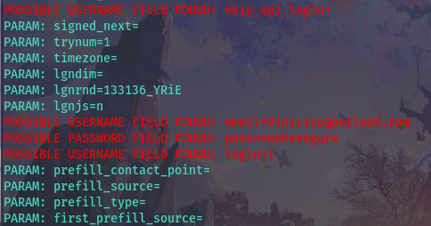

# cybersecurity_desafio_phishing
Bootcamp CyberSecurity - Desafio Phishing

# Ferramentas: 
- Kali Linux
- setoolkit

# Configurando o Phishing no Kali Linux
- Acesso root: sudo su
- Iniciando o setoolkit: setoolkit
- Tipo de ataque: Social-Engineering Attacks
- Vetor de ataque: Web Site Attack Vectors
- Método de ataque: Credential Harvester Attack Method
- Método de ataque: Web Templates
- Obtendo o endereço da máquina: ifconfig
- URL para clone: http://www.facebook.com
- Acessando página falsa para realização do teste
- Captura de credenciais.

# Pagina de Login Falsa:

# Captura de Credenciais:
